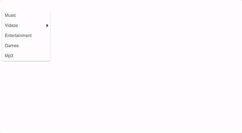
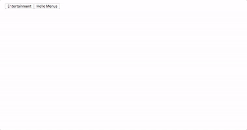

# react-menus-dd

**A highly configurable dropdown menu in React**

## Demo  



## Installation
`npm i -S react-menus-dd`  
  or    
`yarn add react-menus-dd`

## Usage

```javascript
import React, { Component } from 'react';
import { Menu, Menus } from 'react-menus-dd';
// or
const DDMenus = require('react-menus-dd');
const Menus = DDMenus.Menus;
const Menu = DDMenus.Menu;

function TriggerComponent({ toggleMenus, label }) {
  return (
    <button onClick={toggleMenus}>{label}</button>
  );
}

class App extends Component {
  constructor(props, context) {
    super(props, context);
    this.state = {
      visible: false,
      helloMenusVisible: false,
    }
  }

  onClick = (text) => {
    console.info("Text:", text);
  }

  handleMenuClick = (value) => {
    console.info("Clicked Menus's value:", value);
  }
  
  render() {
    const HelloMenus = (
      <Menus label="Hello Menus" triggerComponent={TriggerComponent}>
        <Menu text="Hello" />
        <Menu text="Hello">
          <SubMenus>
            <Menu text="There" />
            <Menu text="There" />
            <Menu text="There" />
          </SubMenus>
        </Menu>
      </Menus>
    )
    const Styles = {
      menusStyle: {
        boxShadow: '1px 1px 2px rgba(90, 90, 90, 0.7)',
        border: '1px solid rgba(0, 0, 0, 0.05)',
      },
      menuStyle: {
        color: 'blue',
        padding: 2,
      },
    };
    
    return (
      <div className="App">
        <Menus label="Entertainment" style={Styles.menusStyle} triggerComponent={TriggerComponent}>
          <Menu text="Music" style={Styles.menuStyle} onClick={this.handleMenuClick} />
          <Menu text="Videos">
            <SubMenus style={{ border: '1px solid red' }}>
              <Menu link="/comedy" text="Comedy" style={{color: '#ac1234'}} />
              <Menu text="Music" onClick={this.onClick} >
                <SubMenus>
                  <Menu text="Rock" />
                  <Menu text="Electro" >
                    <SubMenus>
                      <Menu text="Infected Mushrooms" />
                      <Menu text="Skrillex" />
                      <Menu text="Hyped" />
                    </SubMenus>
                  </Menu>
                  <Menu text="Alternative Rock" />
                </SubMenus>
              </Menu>
              <Menu text="TV Shows">
                <SubMenus>
                  <Menu text="Animation">
                    <SubMenus>
                      <Menu text="Rick & Morty" />
                      <Menu text="Naruto" />
                      <Menu text="Simpsons" />
                    </SubMenus>
                  </Menu>
                  <Menu text="Comedy">
                    <SubMenus>
                      <Menu text="How I Met Your Mother" />
                      <Menu text="Friends" />
                      <Menu text="Sienfeld" />
                      <Menu text="Two And Half Men" />
                    </SubMenus>
                  </Menu>
                  <Menu text="Thriller" />
                </SubMenus>
              </Menu>
            </SubMenus>
          </Menu>
          <Menu text="Entertainment" />
          <Menu text="Games" />
          <Menu text="Mp3">
            <SubMenus>
            <!--
              Add whatever you want here.
              This need not be only <SubMenus />
            -->
              <div>
                <h5>Hello</h5>
                <small>There</small>
                <ul>
                  <li>Tom</li>
                  <li>Is</li>
                  <li>A</li>
                  <li>Good</li>
                  <li>Boy</li>
                </ul>
              </div>
            </SubMenus>
          </Menu>
        </Menus>
        {HelloMenus}
      </div>
    );
  }
}

export default App;
```

## Properties

All properties are optional  
### Menus
- **`style`** _(Object)_ — Custom style properties which will be added to already existing styles.
- **`label`** _(String)_ — Set the label on TriggerComponent.
- **`triggerComponent`** _(Func)_ — Custom Trigger Component which will replace the default TriggerComponent.

### SubMenus
- **`style`** _(Object)_ — Custom style properties which will be added to already existing styles.

### Menu
- **`style`** _(Object)_ — Custom style properties which will be added to already existing styles.

- **`link`** _(String)_ — Link which is equivalent to *href*.

- **`onClick`** _(Func)_ — Invokes when a menu is clicked and text from `<a>Text</a>` is passed as parameter.

## License

MIT
